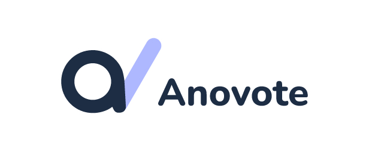

# ANOVOTE FRONTEND

## Table of contents
- [General info](#general-info)
- [Technologies](#technologies)
    - [Frontend Technologies](#frontend-technologies)
    - [Test Technologies](#test-technologies)
- [Start development](#start-development)
    - [Anovote CLI](#anovote-cli)
    - [Local development](#local-development)
    - [Docker development](#docker-development)
- [Build frontend](#build-frontend)
    - [Yarn](#yarn)
    - [Docker](#docker)
## General info
This is the frontend repository fro anovote, a digital anonymous voting system.
## Technologies

### Frontend Technologies
- [TypeScript](https://www.typescriptlang.org/)
- [Node](https://nodejs.org/en/)
- [Yarn](https://yarnpkg.com/)
- [React](https://reactjs.org/)
- [Ant design](https://ant.design/)
- [Axios](https://github.com/axios/axios)
- [Socket.io-client](https://socket.io/docs/v3/client-api/index.html)

### Test Technologies
- [Jest](https://jestjs.io/)
- [Enzyme](https://enzymejs.github.io/enzyme/)
- [React testing library](https://testing-library.com/docs/react-testing-library/intro/)
## Start development

### Anovote CLI
The anovote frontend comes with an Anovote CLI, which can be used to start or clean the development environment. \
Since the anovote CLI is located in the root folder, you may have to run `chmod +x ./anovote` for execution access. \
It is therefore recommended to run the Anovote CLI on a linux based system.

To be able to use the Anovote CLI, Docker and Docker compose needs to be installed on the device.

The Anovote CLI comes with the following commands:
- `anovote dev`, which starts the development environment.
- `anovote dev --build`, which builds images and starts containers.
- `anovote dev --down`, which stops the development containers, removes all volumes and clear all orphan child containers.
- `anovote dev --force`, which re-creates the containers and starts the development environment.

### Local development

#### Requirements
- Node
- Yarn

#### Start
1. Run `yarn install`
2. Run `yarn start`
    1. This will start a local development server, and automatically open a website where the frontend will be visible.
3. Let the code fly!
    1. Hot reloading is enabled, so the development server restarts on code change in the `src` directory.

### Docker development

#### Requirements
- Docker
- Docker compose
- Node (Optional)
- Yarn (Optional)

#### Start
1. (Optional) Run `yarn install`
    1. This is only required for getting types in your editor, but is not required for running as the container has its own node_modules folder.
2. Run `./anovote dev --build`
    1. If the images are already built, run `./anovote dev`
    2. As described in the [Anovote CLI](#anovote-cli) section, this might require execution permissions.
3. Let the code fly!
    1. Hot reloading is enabled, so the development server restarts on code change in the `src` directory.

### Build frontend
There are two ways to build the frontend, locally with yarn and with Docker.

#### Yarn
1. Run `yarn install`
2. Run `yarn build` (This will take a while, crab a cup of tea and wait 🍵)

#### Docker
1. Run `./anovote prod --build`(This will take a while, crab a cup of tea and wait 🍵)
